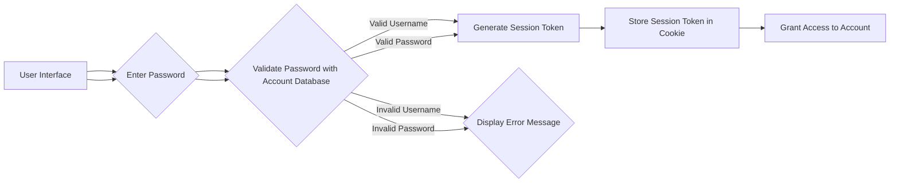

# SLDC - TESTING & QA

_This document is for ***educational purposes*** only. I've included a login validation scenario for a mobile banking app to keep the document simple, yet comprehensive._

   
## What is the Software Development Lifecycle (SDLC)?
SDLC is a process used to create software that meets the stakeholders' requirements cost-efficiently. It helps developers avoid rework by building software as per the client's needs and receiving constant feedback.

## Testing & The Software Development Lifecycle
The below RUP diagram created by IBM shows that Testing & QA is present throughout the entire SDLC:

### Phase 01: Planning
This phase focuses on understanding the needs, defining the project scope, and creating a solid execution plan.

| EXAMPLE OF TESTING & QA ROLES IN PLANNING |
|-------------------------------------------|
| Identifying Potential Risks |
| Defining Testability | 
| Providing Input on Feasibility |

This is an example of a project called ZippyBank, where I assessed the potential risks, challenges, and improvements of the login requirements and included them as comments. I created the template, but it can be adapted depending on the needs of the project/tester.

### Phase 02: Design
The design phase is like laying out the blueprints for a building. Here, the development team translates the requirements into a technical roadmap for the software. 

| EXAMPLE OF TESTING & QA ROLES IN DESIGN |
|-----------------------------------------|
| Reviewing UI mockups |
| Analyzing dataflow diagrams | 
| Participating in design reviews |

Here's an example dataflow datagram for the ZippyBank app:

And an example of feedback provided to help make the data flow more comprehensible and avoid bottlenecks for the developers:

